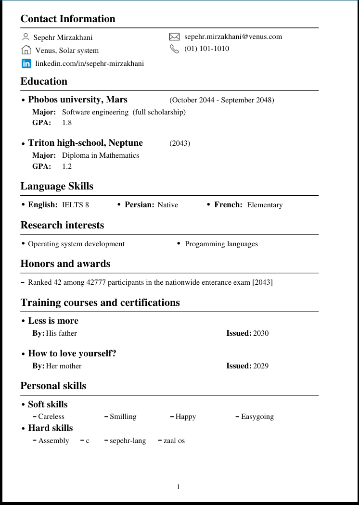

# bisotun
A simple & minimal wrapper library around [PDFGen](https://github.com/AndreRenaud/PDFGen) to generate resume/documents/books.

[](https://www.youtube.com/watch?v=Qm_yZY3gviE)

# why?
I need to generate PDF files, mostly to write my resume. There are some options avilable:
1. WYSIWYG tools like Microsoft Word or open source alternatives.
2. Typesetting systems like Tex/Latex, groff/troff/nroff, etc..
3. Online websites.

I tested all of the them and TBH none of satisfied me. The values that i appreciate:
- having a tool to allows me generate a PDF file in a simple and minimal manner.
- having 100% control over my tool.
- less LOC can means more chance to read(and understand) the source code by people:
  - LOC of [latex](https://github.com/latex3/latex2e): 620428 
  - LOC of PDFGen repo: 5987, LOC of bisotun: 400 --> in total: less than 7000!

- and it's not only about LOC. it's also about complexity. i think Latex/Tex is over-complicated for such a simple task.
- And finally i don't want to talk about online tools, since you don't even know what's happening behind the scene :) 

# structure of the repo
To use __bisotun__, you can just add it as a git submodule to your current project like this:

```
git submodule add https://github.com/LinArcX/bisotun
git submodule update --init --recursive
```

or if you want to do the old way, just copy:
- `bisotun.c`
- `bisotun.h`
- `PDFGen/pdfgen.c`
- `PDFGen/pdfgen.h`

into your project's directory. there's a example directory that you can find how to use the library.

# examples
In __example/__ directory, you can find __resume.c__ which is currently created as a template for resume files. for sure you can change it based on your taste :)
To compile it, you just need a c compiler:

  `gcc -lm -g -o ./output/resume ./examples/resume.c PDFGen/pdfgen.c bisotun.c`

And to run it:

  `./output/resume`

It will generate a pdf file called: `resume.pdf`. now you can open it with any pdf-reader software.

<h1 align="center">
	
    <br/>
    <h4 align="center">A pdf file generated with bisotun</a></h4>
</h1>

# limitations
- PDFGen currently [doesn't support](arbitrary) using TTF fonts.
- It doesn't support [hyperlinks](https://github.com/AndreRenaud/PDFGen/issues/148).
- PDFGen [doesn't support alpha channels in images](https://github.com/AndreRenaud/PDFGen/issues/149).
